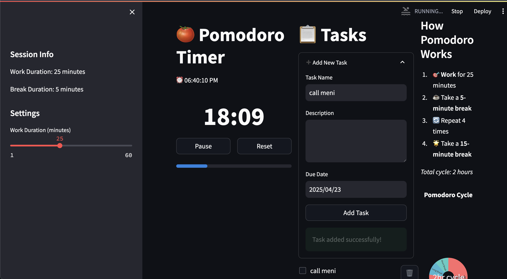

# 🍅 Pomodoro Timer

A simple Pomodoro Timer with task management built using Streamlit.

<div align="center">
  
</div>

## What is the Pomodoro Technique?

The Pomodoro Technique is a time management method that uses a timer to break work into focused intervals, traditionally 25 minutes in length, separated by short breaks. 

### The Basic Process:
1. 🎯 **Work for 25 minutes** (one "Pomodoro")
2. ☕ Take a **5-minute break**
3. 🔄 Repeat 4 times
4. 🌟 Take a **longer 15-minute break**

This cycle helps maintain focus and avoid mental fatigue, making it easier to tackle large tasks or projects.

## Features

- ⏱️ 25/5 minute work/break cycles
- 📋 Task management with due dates
- 🔔 Break notifications
- 📊 Visual progress tracking
- 🎯 Session statistics
- 🌙 Dark mode interface

## Task Management

### Adding Tasks
1. Click "➕ Add New Task" in the tasks panel
2. Enter task details:
   - Task name (required)
   - Description (optional)
   - Due date (defaults to today)
3. Click "Add Task" to save

### Managing Tasks
- ✅ Check the box to mark tasks as complete
- 🔍 Click to expand task details
- 🗑️ Delete tasks using the trash icon
- 📅 Track due dates with visual indicators
- 🔄 Tasks persist during your session

## Installation

```bash
# Clone the repository
git clone https://github.com/izaqyos/pomodoro.git
cd pomodoro

# Create and activate conda environment
conda create -n pomodoro python=3.10
source activate_env.sh

# Install dependencies
pip install -r requirements/dev.txt
```

## Usage

```bash
# Run the app
streamlit run src/main.py

# Run in development mode (auto-reload on file changes)
streamlit run src/main.py --server.runOnSave=true
```

### Quick Start Guide

1. **Start a Session**
   - Launch the application
   - Add your tasks for the session
   - Click "Start" to begin your first Pomodoro

2. **During a Pomodoro**
   - Focus on your task
   - Timer will count down from 25 minutes
   - Progress bar shows time remaining

3. **Taking Breaks**
   - When the timer completes, take your break
   - Short breaks: 5 minutes
   - Long breaks: 15 minutes (after 4 Pomodoros)

## Development

### Project Structure
```bash
.
├── src/
│   ├── core/
│   │   ├── __init__.py
│   │   └── timer.py
│   ├── models/
│   │   ├── __init__.py
│   │   └── task.py
│   ├── utils/
│   │   ├── __init__.py
│   │   └── notifications.py
│   ├── __init__.py
│   └── main.py
├── tests/
│   ├── unit/
│   │   ├── __init__.py
│   │   ├── test_timer.py
│   │   └── test_notifications.py
│   └── __init__.py
├── docs/
│   └── images/
│       └── pomodoro-screenshot.png
├── requirements/
│   ├── base.txt
│   ├── dev.txt
│   └── test.txt
├── .gitignore
├── README.md
├── CHANGELOG.md
├── setup.py
├── pyproject.toml
├── run.sh
└── activate_env.sh
```


